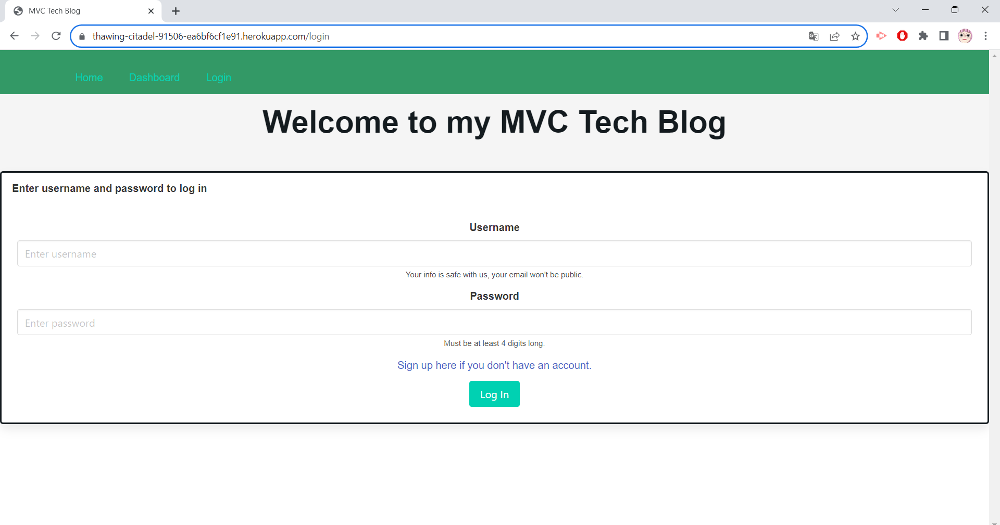

# MVC Tech Blog

## Description
The MVC Tech Blog allows various users to create an account, and to post blog posts. They can also edit and delete their posts, as well as comment on other users' posts. 

## Screenshot

## Deployed Heroku page

https://thawing-citadel-91506-ea6bf6cf1e91.herokuapp.com/

## Credits

Used snippet of code on helpers.js file from activity 16 on module 14.

